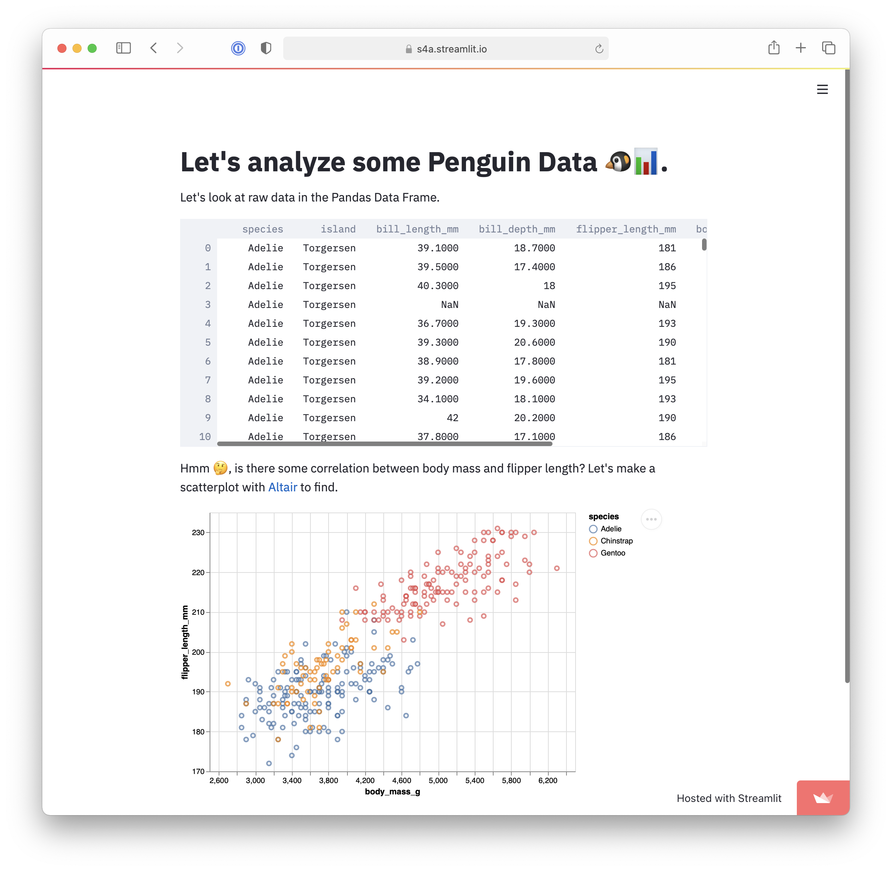

# Project name

TODO: Update screenshot

TODO: Short abstract describing the main goals and how you achieved them.

## Project Goals

In this project, we aim to visualize and explore the **trends and evolution of acoustic features in David Bowie's work from 1969 to 2018** (posthumous releases included).

We started with a large dataset (containing ~340,000 rows) that comprised of various features of albums and songs from the Billboard Top 200 through the decades. After exploring the data, we were mostly intrigued by the following features of each row in our data set: **the danceability, energy, tempo, and valence of each work**. This led us to the realization that with about half a century of data and a sizable list of features to analyze, what we most wanted to visualize was the evolution and musical tendencies of artists with incredible diversity in their work.

With that goal in mind, we chose David Bowie for his extensive and musically-divergent career. Bowie is well-known for his eccentric music styles and wide-reaching influence from his start in the 60s to his death in 2016.

This project consists of three parts:

- Charts allowing for visualization of acoustic features in the songs and the distributions of such features in various albums
- Comparison of the acoustic features in David Bowie albums vs. the overall features in other works by decade
An interactive music search feature that allows users to retrieve a list of recommended Bowie songs with selected acoustic features
- Ultimately, our analysis results aim to provide a different view of interpreting David Bowie's work. Moreover, besides searching for particular songs or albums in a traditional music search engine which often requires users to already have a song name in mind, how might we allow users find the work that better fits the context and mood they have in mind?

This project was completed by **Vivian Young** and **Carol Ho** for the Interactive Data Science (Spring 2021) course taught by Professors Adam Perer and Hendrik Strobelt.

## Design

A great design decision help guide the audience through the data smoothly. Our design decisions aimed to incorporate the existing mental model of how people understand music trends and their search behavior. Three main decisions listed below:

#### 1. People relate music style with years/decade
Speaking of music trend in the United States, people talked about it by decade.( The wikipedia also introduce music trend by year:https://en.wikipedia.org/wiki/Music_history_of_the_United_States) Based on this, the x-axis of the scatter chart and the bar chart are order by issued date. And the bar charts of years in scatter charts and search functions allows the user to look for the albums and songs based on the trend. Lastly, the bar chart recalculate the average by decade to compare the album with the trend of music.

#### 2. The psychology effect of color
Based on psychology study, color evoke emotions connection. Though it might different by culture and personal experience, but generally, warm colors, such as red, orange, yellow are perceive as positive, while bool colors such as blue, purple and green are perceive as calm, sad and indifference. This emotional connection suit well with the definition of **Valence**. 

> Valence: Describes the musical positiveness conveyed by a track. Tracks with high valence sound more positive (e.g. happy, cheerful, euphoric), while tracks with low valence sound more negative (e.g. sad, depressed, angry).

Since the definition of valence is new for most of the audience, connecting the meaning of color and the variable at valence help reduce cognitive load. The color on scatter chart shows how the selected features, moods and valence distribute across the albums, which shows the variety style of Bowie's work. By clicking on the legend area to focus on a specific valence, the audience can also explore the how individual mood distribute across albums.

#### 3. Bar chart comparison development
Initially, we develop a bar chart by pairing the average album and the decade, with one album and one decade in one chart at a time. The comparison explicit, but it tells nothing about how these features(the danceability, energy, and instrumentalness) develop through times. However, putting them in one chart creates a massive amount of information: the chart is crowded with 64 bars of albums and corresponding decade. And it's hard to tell the music trend with the decade bar lying between album bar. Therefore, we decided to overlay the bar and make the opacity to 50%, which allows the audience to tell the overlay and exceed area by color. We also explore how to label the overlay bar charts without distracting the audience; we placed tooltips on each bar chart, but it's impossible to trigger the tooltip when two bars are similarly tall. We improved by marking the data of the decade bars with text, and the tooltip shows only when the audience hovers on the album bar. 

TODO: **A rationale for your design decisions.** How did you choose your particular visual encodings and interaction techniques? What alternatives did you consider and how did you arrive at your ultimate choices?

## Development
### development process
In this three-week project, we collaboratively looked for the ideal dataset in the first week and prioritized our top three data set to look for the research questions. The second week we brought back our research questions and decided to move on with the Spotify data set to explore David Bowie's works. We then shared our research interest in this dataset and developed the charts and functions separately. We spent the last week iterate to allow the users better navigate through the application. Below shows how we collaborate in application development:

- **Scatter Chart - David Bowie's albums:** data query and charts built by Carol, interaction done by both of us
- **Bar Chart - David Bowie's albums with average features:** data query, interaction, and charts built by Carol
- **Acoustic feature song search:** data query, interaction, charts, and API implementation built by Vivian

### What aspect took the most time?
1. Prepare the data for the charts
The type of columns in the dataset need extra effort to tidy up. For example, we convert the date(varchar) to date(datetime) format to interact with the chart by year and rounding up all the decimal numbers to make it easier to read. To get the music data by decade, we also spent time transferring the data value, group by and re-calculate the average and join the calculated results with SQL.
2. Customize the color and interaction of the charts
Altair and Streamlit API are straightforward and easy to implement. But it took us some time to understand the limitation of customization. For example, the user can only interact with the whole line but not the line chart's data point. After digging into the gallery and documentation, we shift our direction to other charts. Therefore, we spent some time iterated various forms, colors, and interactions before coming up with the current application.

## Success Story(WIP)

TODO:  **A success story of your project.** Describe an insight or discovery you gain with your application that relates to the goals of your project.